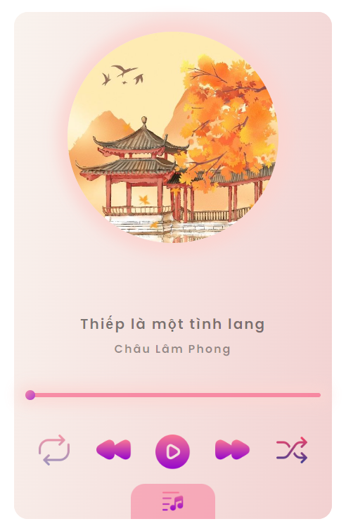
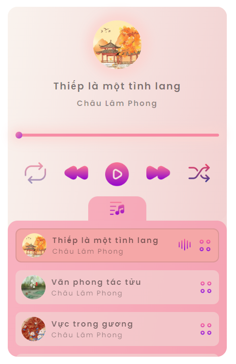

# MUSIC PLAYER APP

## Table of contents

- [Overview](#overview)
- [Function](#function)
- [Screenshot](#screenshot)
- [Author](#author)
- [Resource](#resource)

## Overview
This is the project I have followed along in the basic Javascript course of [F8](https://fullstack.edu.vn/). I changed the Interface, added some components and aniamtions in my taste.  

## Function
- [x] Render songs (local)
- [x] Play/Pause
- [x] Repeat/Random song
- [x] Next/Repeat when audio ended 
- [x] Choose song from playlist
- [x] Scroll active song into view
- [x] CD rotate/stop when song is played/paused
- [x] Set player configs
- [ ] Options with a song
## Screenshot

[Live Site URL](https://anhhuynh1506.github.io/MusicPlayerApp/)

## Author

- Github - [Nguyễn Huỳnh Anh](https://github.com/anhhuynh1506)

## Resource

- [Original project - F8](https://youtu.be/vAecGPWxzFE)
- [Icon from Kuber_Icons](https://www.flaticon.com/authors/kuber-icons) - Play/Pause/Forward/Backward/MusicNote/Playlist/Option/Soundwave
- [Icon from th studio](https://www.flaticon.com/authors/th-studio) - Repeat/Random
- Musics - Youtube
- Images - Pinterest/Youtube
